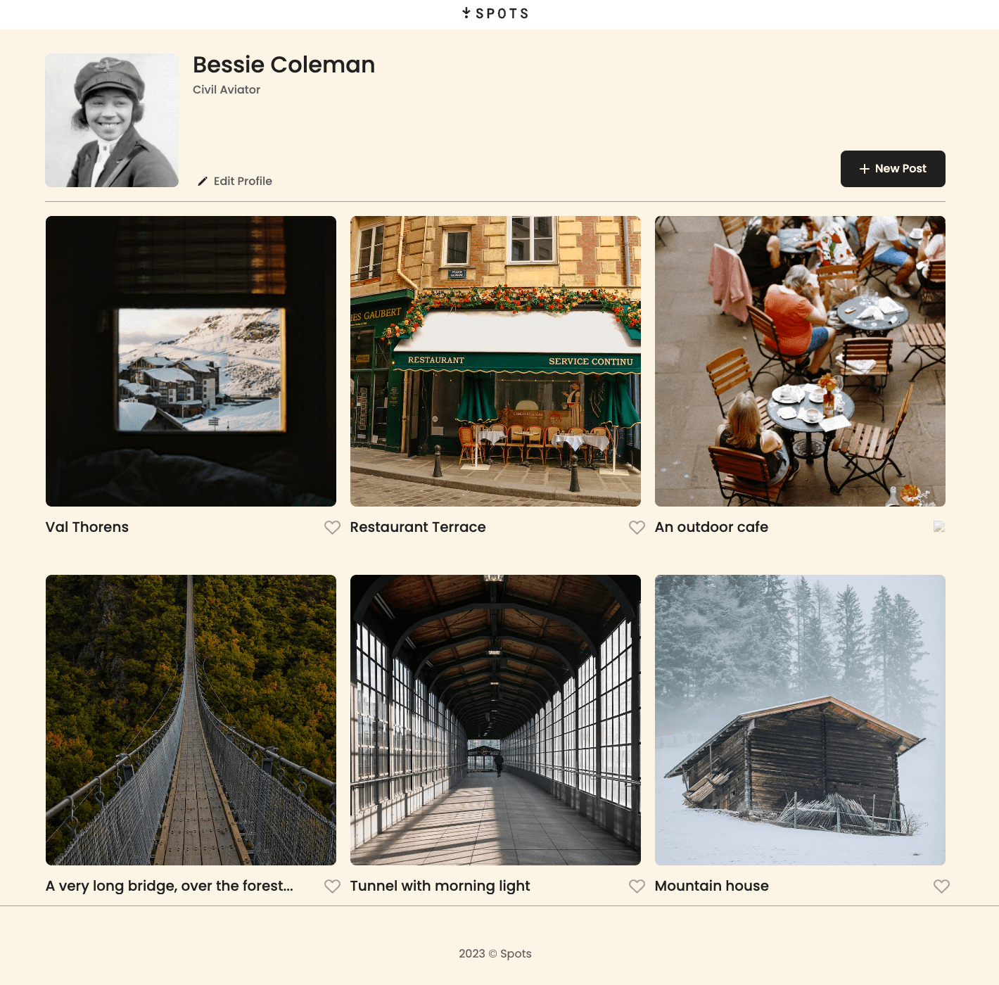
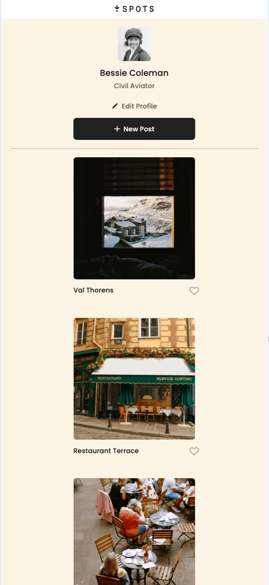

# Project 3: Spots

### Overview

- Intro/description
- Figma
- Images

**Intro/description**
Spots is the beginning of a future social media site for users to share what's important to them. It reminds me a lot of Instagram (the old instagram think 2015). This project built on my skills using flexbox, CSS, HTML and the beginning of using display: Grid features. It's built for multiple screen sizes and it was a challenge at first to understand how to implement @media queries. I will be building on this project in future sprints to make it more interactive with Javascript if I understand correctly.

Using Figma instead of a pdf document was really difficult for me so I won't be surprised if I missed some specifications for items when I get the review back. But I hope I got most things accurate.

## Tech Stack

- HTML
- CSS
- Responsive Design

## Deployment

This webpage is deployed to Github Pages

- Deployment Link: https://oliviakamara.github.io/Spots/

## Figma

- [Link to the project on Figma](https://www.figma.com/file/BBNm2bC3lj8QQMHlnqRsga/Sprint-3-Project-%E2%80%94-Spots?type=design&node-id=2%3A60&mode=design&t=afgNFybdorZO6cQo-1)

## Images/video

-[link to short video showcasing adaptive screen] https://www.loom.com/share/9ec6e3e629074783ad4f762755a5ee72?sid=406e2815-0be5-4850-80bf-ccd047bf6331

